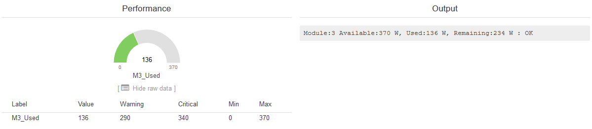
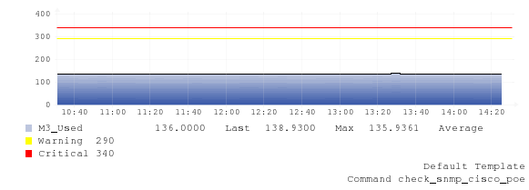

# check_snmp_cisco_poe

This plugin for Nagios/Icinga/Op5 and other compatible systems checks the availability and power used by Power over Ethernet on a Cisco switch.
The plugin uses the [Power Ethernet MIB](https://tools.ietf.org/html/rfc3621) to retrieve the data.
It works with SNMPv1, v2c and v3.

This plugin was created by Michiel Timmers. I have only added the performance data part to it.


## Usage
In order to see help:
```sh
$ ./check_snmp_cisco_poe.pl --help
```

Example output:
```sh
$ ./check_snmp_cisco_poe.pl -H 192.168.0.10 -l username -x password1 -X password2 -w 40 -c 30
Module:2 Available:370 W, Used:19 W, Remaining:351 W : OK | M2_Used=19;330;340;0;370
```


## Screenshots





## Version history
* 0.3 2019-03-06 Added performance data and modified output.
* 0.2 2017-06-07 Fix for Cisco bug CSCtl11469. Data is now collected via a snmpwalk. Support for stacked switches.
___

